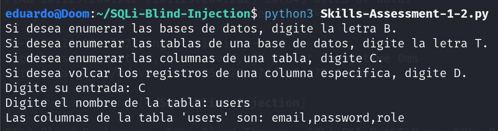

# Blind-SQL-Injection-HTB-Academy
1. PoC: Boolean-based SQLi

2. PoC: Time-based SQLi 

3. PoC: SQLi Stacked Queries-RCE&Leaking-NetNTLM-Hashes

4. PoC: SQLi Stacked Queries-ReadFile

 
5. PoC: Skills Assessment

